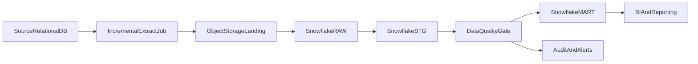

# ETL Flow Diagram

```mermaid
flowchart LR
sourceDB[SourceRelationalDB] --> extractJob[IncrementalExtractJob]
extractJob --> landingZone[ObjectStorageLanding]
landingZone --> rawLayer[SnowflakeRAW]
rawLayer --> stagingLayer[SnowflakeSTG]
stagingLayer --> dqGate[DataQualityGate]
dqGate --> martLayer[SnowflakeMART]
martLayer --> biLayer[BIAndReporting]
dqGate --> auditLayer[AuditAndAlerts]
```
