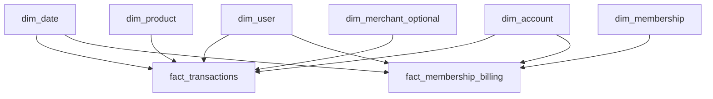

# Star Schema Diagram

```mermaid
flowchart TB
dimDate[dim_date]
dimUser[dim_user]
dimAccount[dim_account]
dimProduct[dim_product]
dimMembership[dim_membership]
dimMerchant[dim_merchant_optional]
factTx[fact_transactions]
factMbr[fact_membership_billing]

dimDate --> factTx
dimUser --> factTx
dimAccount --> factTx
dimProduct --> factTx
dimMerchant --> factTx

dimDate --> factMbr
dimUser --> factMbr
dimAccount --> factMbr
dimMembership --> factMbr
```
